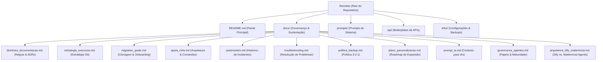

# 📖 CDC Receitas - Central de Inteligência e Automação

Bem-vindo ao repositório oficial **CDC Receitas**. Este espaço foi projetado para centralizar, governar e distribuir conhecimentos, padrões de infraestrutura, boilerplates de APIs e prompts de IA acumulados pela equipe.

O objetivo principal deste repositório é garantir que o conhecimento técnico seja **preservável, portável, reutilizável e seguro por padrão**.

### 🤖 O Papel do Dify no CDC

A plataforma **Dify** foi adotada como o orquestrador central de LLMs no CDC. O Dify atua como o elo operacional que conecta nossos documentos e bases de conhecimento (Wiki em Markdown) aos provedores de inteligência artificial (como o Google AI Studio / Gemini 1.5 Flash). Ele gerencia o fluxo de RAG (*Retrieval-Augmented Generation*), o histórico de conversação e os limites de requisições, permitindo que a IA responda de forma contextualizada e direta em canais corporativos (via webhooks do Mattermost). 

Com isso, a aplicação do Dify no CDC nos permite implantar e sustentar de forma integrada:
*   **Agente de Consulta a Wiki**: Resposta automática a dúvidas operacionais e técnicas sem busca manual.
*   **Agentes de Automação de Rotinas**: Execução de auditorias de backups, revisão automática de código (Code Review) e triagem inteligente de alertas de incidentes.

---

## 🗺️ Mapa Visual do Repositório

O fluxo e a organização das pastas e arquivos de sustentação seguem o mapeamento abaixo:

---

## 🗂️ Índice Estruturado

### 1. Governança e Documentação (`docs/`)
Toda a documentação operacional e de governança do repositório está localizada na pasta [docs/](file:///home/vier/Documentos/Code/CDC/Agentes%20de%20IA/docs/):
*   [Diretrizes de Documentação](file:///home/vier/Documentos/Code/CDC/Agentes%20de%20IA/docs/diretrizes_documentacao.md): Regras de escrita, tom de voz e Registro de Decisões de Arquitetura (ADR).
*   [Estratégia de Execução](file:///home/vier/Documentos/Code/CDC/Agentes%20de%20IA/docs/estrategia_execucao.md): Boas práticas para Git, criação de ramificações (branches) e padrões de commits.
*   [Guia de Migração & Onboarding](file:///home/vier/Documentos/Code/CDC/Agentes%20de%20IA/docs/migration_guide.md): Passo a passo para clonagem, setup de novas máquinas e sincronização segura.
*   [Ajuda de Infraestrutura](file:///home/vier/Documentos/Code/CDC/Agentes%20de%20IA/docs/ajuda_infra.md): Comandos rápidos do terminal e mapa técnico de infraestrutura.
*   [Histórico Postmortem](file:///home/vier/Documentos/Code/CDC/Agentes%20de%20IA/docs/postmortem.md): Registro incremental de falhas e aprendizados (alimentação contínua).
*   [Troubleshooting](file:///home/vier/Documentos/Code/CDC/Agentes%20de%20IA/docs/troubleshooting.md): Guia rápido para solução de erros ao executar receitas.
*   [Política de Backup](file:///home/vier/Documentos/Code/CDC/Agentes%20de%20IA/docs/politica_backup.md): Definição de redundância de dados baseada no padrão 3-2-1.
*   [Plano de Personalização](file:///home/vier/Documentos/Code/CDC/Agentes%20de%20IA/docs/plano_personalizacao.md): Roteiro para expansão e criação de novas categorias de receitas.
*   [Prompt da IA Co-piloto](file:///home/vier/Documentos/Code/CDC/Agentes%20de%20IA/docs/prompt_ia.md): Contexto fixo e regras permanentes para assistentes de inteligência artificial.
*   [Governança de Agentes](file:///home/vier/Documentos/Code/CDC/Agentes%20de%20IA/docs/governanca_agentes.md): Definição de papéis, responsabilidades e maturidade dos múltiplos agentes de IA do CDC.
*   [Arquitetura Dify vs. Mattermost Agents](file:///home/vier/Documentos/Code/CDC/Agentes%20de%20IA/docs/arquitetura_dify_mattermost.md): Análise técnica de responsabilidades e prevenção de conflitos.

### 2. Recursos Reutilizáveis
*   [prompts/](file:///home/vier/Documentos/Code/CDC/Agentes%20de%20IA/prompts/): Coleção de templates de prompts de sistema e meta-prompts validados para produção.
*   [api/](file:///home/vier/Documentos/Code/CDC/Agentes%20de%20IA/api/): Boilerplates em linguagens populares (Python, JS) para integração com APIs comuns.
*   [infra/](file:///home/vier/Documentos/Code/CDC/Agentes%20de%20IA/infra/): Arquivos de configuração de infraestrutura, DNS, cofres e rotinas de backup. Inclui o arquivo de configuração para o proxy reverso Nginx ([nginx-dify.conf](file:///home/vier/Documentos/Code/CDC/Agentes%20de%20IA/infra/nginx-dify.conf)).

---

## 🔒 Segurança em Primeiro Lugar

> [!WARNING]
> **NUNCA** adicione chaves de API, credenciais de banco de dados, tokens reais ou arquivos `.env` neste repositório. Use sempre placeholders no formato `<NOME_DA_VARIAVEL>` e carregue-os via variáveis de ambiente.
> 
> Consulte o arquivo [.gitignore](file:///home/vier/Documentos/Code/CDC/Agentes%20de%20IA/.gitignore) para garantir que arquivos confidenciais não sejam rastreados.
